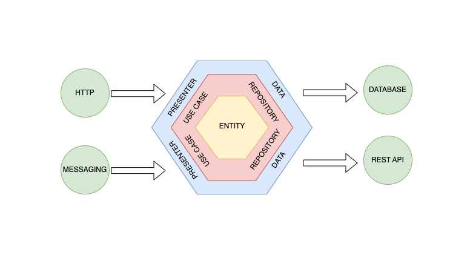
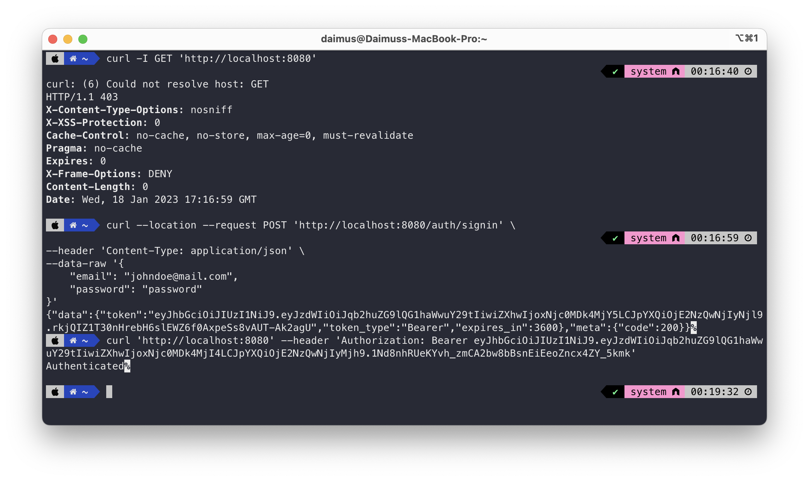
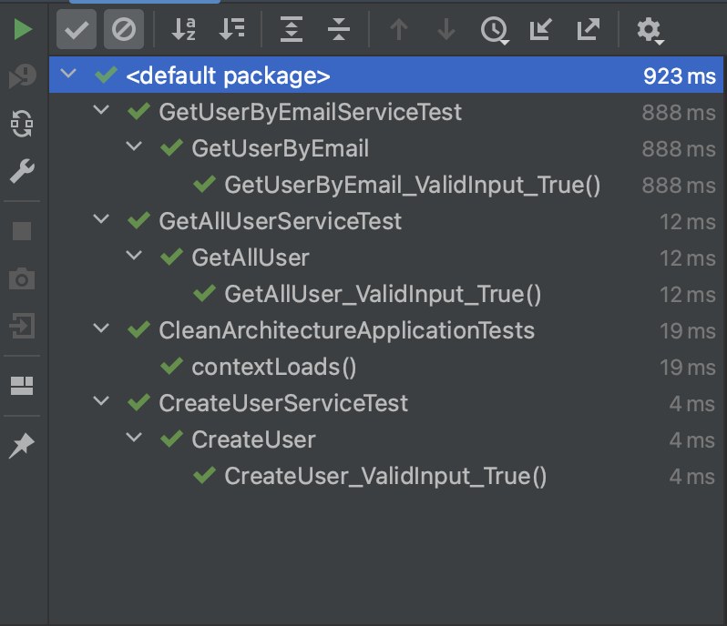

# Day 11 - Clean Architecture

## Problem 1 - Rewrite ✅

1. **Presenter**/Input/Driving/Gateway merupakan bagian yang menangani komunikasi masuk ke aplikasi, dapat melakukan trigger ke use case tertentu.
2. **Use Case**/Service/Interactor merupakan interface yang mengorkestrasi business logic
3. **Entity**/Model adalah domain object yang bersifat technology-agnostic (tidak peduli dimana/dengan teknologi apa dia disimpan)
4. **Repository**/Driven/External Interface meripakan interface yang menyimpan kontrak bagaimana entity didapatkan/dimanipulasi
5. **Data**/Data Source merupakan adapter atau implementasi bagaimana data dikelola dengan teknologi tertentu
## Problem 2 - Implementasi JWT ✅
### Initial Email dan Password

| Email            | Password |
|------------------|----------|
| johndoe@mail.com | password |
| janedoe@mail.com | password |

### Endpoints

| Endpoint     | HTTP Method | Request Body                         | Auth Type | Keterangan                                                                                           |
|--------------|-------------|--------------------------------------|----------|------------------------------------------------------------------------------------------------------|
| /            | GET         |                                      | Bearer   | Jika berhasil login maka akan tampil response "Authenticated", jika tidak maka akan muncul error 403 |
| /auth/signin | POST        | { "email": "", "password": "" } |          |                                                                                                      |

### Pengujian

## Problem 3 - Implementasi Unit Test
- ❔ Code coverage > 80%
- ✅ Menerapkan mocking

### Pengujian
