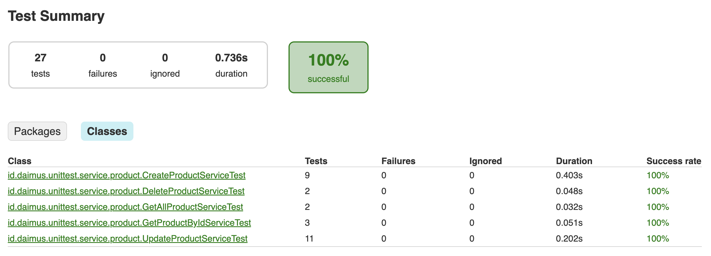
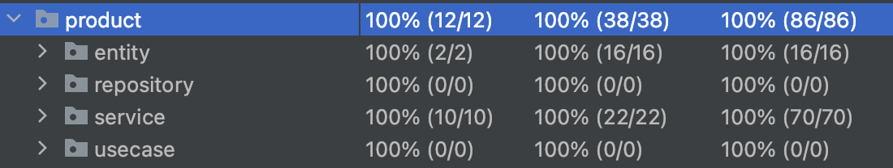

# Day 14 - Unit Test

## Problem 1 - Implementasi Unit Test ✅

| No  | Function          | Test Case                              | Expected Result                    | Pass? |
|-----|-------------------|----------------------------------------|------------------------------------|-------|
| 1   | Get All Product   | Product Exist                          | Return List of Products            | ✅     |
| 2   |                   | Product Not Exist                      | Throw DataNotFoundException        | ✅     |
| 3   | Create Product    | Product Valid                          | Return Created Product             | ✅     |
| 4   |                   | Product Is Empty Object                | Throw ConstraintViolationException | ✅     |
| 5   |                   | Product Is Null                        | Throw IllegalArgumentException     | ✅     |
| 6   |                   | Product Name Is Null                   | Throw IllegalArgumentException     | ✅     |
| 7   |                   | Product Description Is Null            | Throw IllegalArgumentException     | ✅     |
| 8   |                   | Product Stock Is Null                  | Throw IllegalArgumentException     | ✅     |
| 9   |                   | Product Stock < 0                      | Throw IllegalArgumentException     | ✅     |
| 10  |                   | Product Price Is Null                  | Throw IllegalArgumentException     | ✅     |
| 11  |                   | Product Price < 0                      | Throw IllegalArgumentException     | ✅     |
| 12  | Get Product By Id | Product Exist                          | Return List of Products            | ✅     |
| 13  |                   | Product Not Exist                      | Throw DataNotFoundException        | ✅     |
| 14  |                   | Product Id Is Null                     | Throw DataNotFoundException        | ✅     |
| 15  | Update Product    | Product Is Exist And Product Valid     | Return Updated Product             | ✅     |
| 16  |                   | Product Is Not Exist And Product Valid | Throw DataNotFoundException        | ✅     |
| 17  |                   | Product Is Empty Object                | Throw ConstraintViolationException | ✅     |
| 18  |                   | Product Is Null                        | Throw IllegalArgumentException     | ✅     |
| 19  |                   | Product Id Is Null                     | Throw DataNotFoundException        | ✅     |
| 20  |                   | Product Name Is Null                   | Throw IllegalArgumentException     | ✅     |
| 21  |                   | Product Description Is Null            | Throw IllegalArgumentException     | ✅     |
| 22  |                   | Product Stock Is Null                  | Throw IllegalArgumentException     | ✅     |
| 23  |                   | Product Stock < 0                      | Throw IllegalArgumentException     | ✅     |
| 24  |                   | Product Price Is Null                  | Throw IllegalArgumentException     | ✅     |
| 25  |                   | Product Price < 0                      | Throw IllegalArgumentException     | ✅     |
| 26  | Delete Product    | Product Exist                          | Return True                        | ✅     |
| 27  |                   | Product Not Exist                      | Throw DataNotFoundException        | ✅     |

### Test Result

### Test Coverage
**Product Service**
