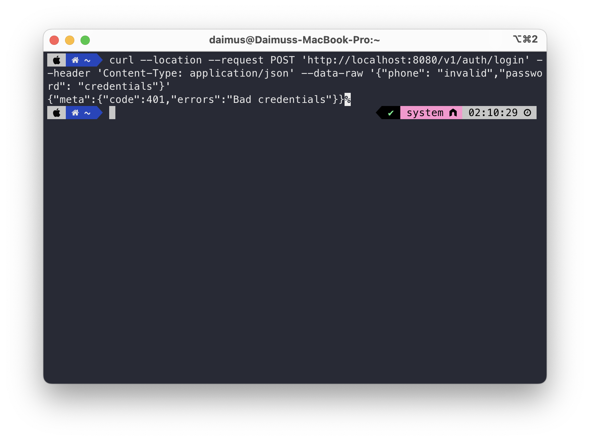

# Day 12 - Spring JWT

## Problem 1 - JWT Generatiom ✅
### Initial Credentials

| Phone         | Password |
|---------------|----------|
| 081234567890  | password |
| 087773775774  | password |

### Endpoints

| Endpoint       | HTTP Method | Request Body                                | Auth Type | Keterangan                                                                                           |
|----------------|-------------|---------------------------------------------|----------|------------------------------------------------------------------------------------------------------|
| /              | GET         |                                             | Bearer   | Jika berhasil login maka akan tampil response "Authenticated", jika tidak maka akan muncul error 403 |
| /v1/auth/login | POST        | { "phone": "", "password": "" } |          |                                                                                                      |

### Pengujian

